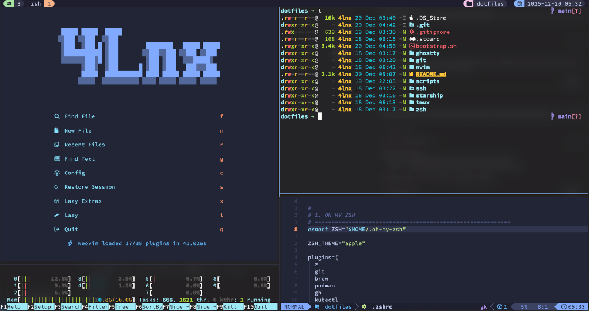

# Dotfiles

> Automated configuration for a modern development environment. One command bootstrap.




## Features

- **Full Desktop Environment** — Hyprland with Waybar status bar, Rofi launcher, and SwayNC notifications
- **Smart Package Management** — detects your OS (Arch, macOS, Ubuntu) and installs everything automatically, including AUR packages via yay
- **Modern Shell** — Zsh + Starship prompt + Oh My Zsh + Tmux with TPM plugins
- **Neovim** — LazyVim-based editor with LSP, formatters, and a curated plugin set
- **XDG Compliant** — all configs neatly organized under `~/.config/`
- **Idempotent** — safe to re-run the bootstrap as many times as you want

## What It Configures

| Category     | Tools                                                           |
| ------------ | --------------------------------------------------------------- |
| **Desktop**  | `hyprland`, `hyprpaper`, `hyprlock`, `waybar`, `rofi`, `swaync` |
| **Shell**    | `zsh`, `oh-my-zsh`, `starship`, `eza`, `fzf`, `fd`              |
| **Terminal** | `ghostty`, `tmux` (TPM)                                         |
| **Editor**   | `neovim` (LazyVim)                                              |
| **Dev**      | `git`, `ssh`, `docker`, `mise`, `lazygit`, `lazydocker`         |
| **Apps**     | `dolphin`, `keepassxc`, `obsidian`, `brave`, `discord`, `steam` |

## Quick Start

```bash
git clone https://github.com/4lnx/dotfiles ~/dotfiles
cd ~/dotfiles
./bootstrap.sh
```

The bootstrap detects your OS, installs required packages, links all config files
via GNU Stow installs Oh My Zsh, Tmux TPM plugins,
the Nerd Font, and sets Zsh as your default shell.

## Structure

```
dotfiles/
├── bootstrap.sh          # Entry point — install + link everything
├── scripts/
│   ├── arch-app.sh       # Arch Linux (pacman + yay/AUR)
│   ├── osx-app.sh        # macOS (Homebrew)
│   └── ubuntu-app.sh     # Ubuntu (apt)
├── hypr/                 # Hyprland compositor config
├── waybar/               # Status bar
├── swaync/               # Notification center
├── rofi/                 # App launcher & utility scripts
├── ghostty/              # Terminal emulator
├── zsh/                  # Shell
├── tmux/                 # Terminal multiplexer
├── nvim/                 # Neovim editor
├── ssh/                  # SSH client config
├── git/                  # Git config
├── starship/             # Prompt theme
└── images/               # Screenshots
```

## OS Support

| OS         | Package Manager | AUR Support |
| ---------- | --------------- | ----------- |
| Arch Linux | pacman + yay    | ✅          |
| macOS      | Homebrew        | N/A         |
| Ubuntu     | apt             | N/A         |

## Customizing

Each directory under `dotfiles/` is a standalone stow package. Add or remove directories freely — the bootstrap will pick them up.

```bash
stow zsh      # Link only zsh config
stow -D zsh   # Unlink zsh config
```
